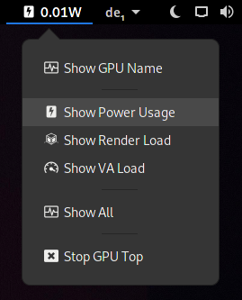

# Gnome Indicator Extension for Intel GPUs

Shows 3D rendering load, video acceleration load, and power usage of Intel GPUs
using `intel_gpu_top`.



## Requirements

1. Install `intel_gpu_top` provided by the `intel-gpu-tools` package. Try running it:

2. Allow your Desktop user to run `intel_gpu_top` as `root` without password prompt.
   This can be easily set up with a new sudoers files such as `/etc/sudoers.d/10-intel_gpu_top`:
   ```
   your_user_name ALL = (root) NOPASSWD: /usr/bin/intel_gpu_top
   ```
3. Make sure the binary path in the sudoers file points to the actual `intel_gpu_top` binary in your system.

## Local Installation

```
make install
make restart  # soft-restart Gnome Shell or press Alt+F2, r, Enter (Xorg only)
```
At the first time installation, you also need to enable the extension in the Gnome Extension Manager
or using the Gnome Shell Integration in your browser at [extensions.gnome.org/local](https://extensions.gnome.org/local). 


## Development

Run `make help` to learn how to develop and read the [development doc](DEVELOPMENT.md) for more details.

Find the latest version at the development website: https://github.com/ubunatic/gnome-intel-gpu-indicator


## Icons

Except for some hand-drawn indicator icons in [src/icons/ubunatic](src/icons/ubunatic)
all used [icons](src/icons) are from [fontawesome.io](http://fontawesome.io) obtained via
[github.com/encharm/Font-Awesome-SVG-PNG](https://github.com/encharm/Font-Awesome-SVG-PNG).


